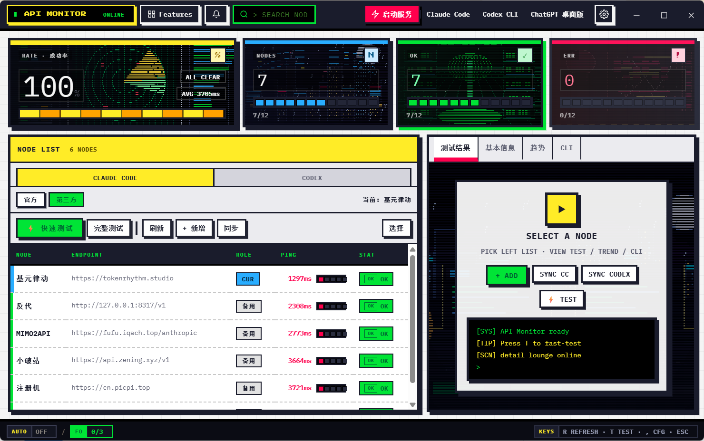

<div align="center">
  

  # API Monitor

  **Windows 桌面端 API 供应商监控工具 —— 定时测速 · 故障切换 · 托盘常驻 · 密钥加密**

  [](https://github.com/249469326i-lang/api-monitor/actions/workflows/ci.yml)
  [](https://github.com/249469326i-lang/api-monitor/releases)
  [](https://github.com/249469326i-lang/api-monitor/releases)
  [](LICENSE)
  [](#-系统要求)
  [](#-源码运行)
  [](https://github.com/249469326i-lang/api-monitor/commits/main)

  [下载使用](#-下载与安装) · [功能特性](#-功能特性) · [源码构建](#-源码运行) · [贡献指南](CONTRIBUTING.md) · [问题反馈](https://github.com/249469326i-lang/api-monitor/issues)

  
</div>

---

## 📖 目录

- [功能特性](#-功能特性)
- [下载与安装](#-下载与安装)
- [系统要求](#-系统要求)
- [快速上手](#-快速上手)
- [源码运行](#-源码运行)
- [打包独立 EXE](#-打包独立-exe)
- [项目结构](#-项目结构)
- [配置与数据](#-配置与数据)
- [运行测试](#-运行测试)
- [安全说明](#-安全说明)
- [路线图](#-路线图)
- [参与贡献](#-参与贡献)
- [开源协议](#-开源协议)

## ✨ 功能特性

| | 功能 | 说明 |
| --- | --- | --- |
| 📡 | **多供应商监控** | 同时监控多个 API 供应商 / 模型的延迟与可用性，支持 Anthropic / OpenAI / Gemini 等多种 API 格式自动探测 |
| ⏱️ | **定时探测** | 自定义探测间隔，失败自动重试；死端点智能短路，不拖慢整轮测试 |
| 🔀 | **故障转移** | 主线路异常时自动切换到备用供应商（可配置冷却时间、最大切换次数、切换前确认） |
| 📈 | **历史趋势** | 延迟历史、P95、可用率统计与趋势图表 |
| 🖥️ | **托盘常驻** | 最小化到系统托盘，支持开机自启 |
| 🔐 | **密钥加密** | API Key 使用 Windows DPAPI 本地加密存储，绝不明文落盘，前端仅展示掩码 |
| 💾 | **备份恢复** | SQLite 在线备份 API 保证一致性，支持自动定期备份 |
| 📦 | **单文件分发** | 打包为独立 `API-Monitor.exe`，下载即用，无需安装 Python |
| 🎨 | **像素风 UI** | 内置像素风格 Web 前端（PyWebView 渲染），字体本地化、离线可用 |

## 📥 下载与安装

**普通用户（推荐）：**

1. 前往 [Releases](https://github.com/249469326i-lang/api-monitor/releases) 页面
2. 下载最新版本的 `API-Monitor.exe`
3. 双击运行，无需安装

> ⚠️ **前置条件**：需要系统已安装 **Microsoft Edge WebView2 Runtime**（Windows 10/11 通常已自带；LTSC 或精简版系统可能缺失，需自行安装）。
>
> ⚠️ **关于 SmartScreen 提示**：程序未购买代码签名证书，首次运行可能出现 Windows SmartScreen 警告，点击「更多信息 → 仍要运行」即可。不放心的话欢迎直接从源码构建（见下文）。

首次运行会在 `%APPDATA%\.api-monitor\` 下创建本地配置与数据库（旧版 `.cc-switch-monitor` 目录会自动迁移）。

## 💻 系统要求

| 项目 | 要求 |
| --- | --- |
| 操作系统 | Windows 10 / 11 (x64) |
| 运行时 | Microsoft Edge WebView2 Runtime（Win10/11 通常已预装） |
| 磁盘空间 | ~50 MB |
| 网络 | 可访问你所配置的 API 端点 |

## 🚀 快速上手

1. 启动后点击「添加供应商」，填入 API 地址与 Key
2. 选择需要监控的模型，设置探测间隔
3. 主面板实时显示各线路延迟与状态，异常时自动故障切换
4. 关闭窗口自动最小化到托盘，右键托盘图标可退出

## 🛠️ 源码运行

```bash
# 1. 克隆仓库
git clone https://github.com/249469326i-lang/api-monitor.git
cd api-monitor

# 2. 安装依赖（建议 Python 3.10+）
python -m pip install -r requirements.txt

# 3. 运行
python main.py
```

## 📦 打包独立 EXE

```bash
# 安装完整依赖（含 PyInstaller）
python -m pip install -r requirements-dev.txt

# 一键打包（自动清理旧进程 → 构建 → 输出到项目根目录）
rebuild.bat

# 或者手动执行
pyinstaller --noconfirm --clean API-Monitor.spec
```

产物为单文件 `API-Monitor.exe`（约 30–35 MB），已内置 `web/` 前端资源，可直接拷贝给没有 Python 环境的 Windows 机器使用。

> 正式版本一律通过 [GitHub Releases](https://github.com/249469326i-lang/api-monitor/releases) 分发，exe **不会**提交进源码仓库——请只从 Releases 页下载，谨防第三方镜像篡改。

## 🗂️ 项目结构

```text
api-monitor/
├── main.py                 # 程序入口（窗口创建与 webview 引导）
├── core/                   # 后端核心模块
│   ├── app_api.py          #   前端 js_api 桥接层（全部后端接口）
│   ├── testing.py          #   端点探测（多 API 格式自动识别）
│   ├── failover.py         #   自动故障切换
│   ├── scheduler.py        #   定时测试调度器
│   ├── crypto.py           #   DPAPI 密钥加密
│   ├── db.py / paths.py    #   SQLite 存储与数据目录管理
│   ├── win32_window.py     #   Win32 窗口辅助（单实例/居中/任务栏）
│   └── ...                 #   托盘、通知、导出、更新检查等
├── web/                    # 前端 UI（index.html / css / js / assets）
├── docs/                   # CODE_WIKI、截图与开发文档
├── .github/                # CI workflow 与 Issue / PR 模板
├── API-Monitor.spec        # PyInstaller 打包规格（白名单资源）
├── rebuild.bat             # 一键重打包脚本
├── bump_version.py         # 发版时统一更新各处版本号
├── verify_backend.py       # 后端 API 冒烟验证（临时目录隔离）
├── test_fetch_models_isolation.py  # 单元测试
└── requirements.txt        # 运行时依赖
```

模块级目录树与职责说明以 [docs/CODE_WIKI.md](docs/CODE_WIKI.md) 为准，避免多处维护分叉。

## ⚙️ 配置与数据

| 路径 | 用途 |
| --- | --- |
| `%APPDATA%\.api-monitor\` | 本地配置、加密后的 Key、历史探测数据（首次启动自动从旧 `.cc-switch-monitor` 迁移） |
| 应用内「设置」 | 超时、重试次数、探测间隔、开机自启、自动更新等 |

所有数据均保存在用户目录，**不会**写入程序安装目录。网络请求仅发往两类目标：你在应用内自行配置的 API 端点（探测时需携带对应 Key，这是监控功能本身），以及本仓库的 GitHub Releases（自动更新检查，可在设置中关闭）。此外不向任何服务器发送数据。

## ✅ 运行测试

```bash
# 单元测试（DB 隔离，不触碰真实数据）
python -m unittest test_fetch_models_isolation -v

# 后端 API 冒烟验证（自动重定向到临时目录）
python verify_backend.py
```

每次 push / PR 都会在 GitHub Actions（windows-latest）上自动执行上述验证。提交前请按 [贡献指南](CONTRIBUTING.md#提交改动前) 本地跑通。

## 🔐 安全说明

- API Key 使用 **Windows DPAPI** 本地加密，仅当前 Windows 用户可解密
- 请勿提交真实 API Key、`providers.db` 或本地配置
- 自动更新仅检查本仓库 GitHub Releases（可在设置中关闭）

完整说明与漏洞报告方式见 [SECURITY.md](SECURITY.md)。**不要**直接开公开 Issue 报告安全问题。

## 🗺️ 路线图

- [x] 像素风 UI、独立 Provider 存储、自动更新
- [x] 全面安全加固（密钥零明文下发、XSS/注入防护、WAL 一致性备份）
- [x] CI 自动化测试（GitHub Actions）
- [x] 模块化架构重构（分层 core/）
- [ ] 探测历史图表与数据导出增强
- [ ] 更多供应商预设模板
- [ ] 多语言界面（欢迎 PR）

完整规划与进展见 [Issues](https://github.com/249469326i-lang/api-monitor/issues)。

## 🤝 参与贡献

欢迎 Issue 与 Pull Request！提交前请先阅读 [贡献指南](CONTRIBUTING.md)。

1. Fork 本仓库
2. 新建特性分支 `git checkout -b feature/your-feature`
3. 提交改动 `git commit -m "feat: add your feature"`
4. 推送分支 `git push origin feature/your-feature`
5. 发起 Pull Request

较大的改动建议先开 Issue 讨论方案。

## 📄 开源协议

本项目基于 [MIT License](LICENSE) 开源 © 2026 249469326i-lang。
